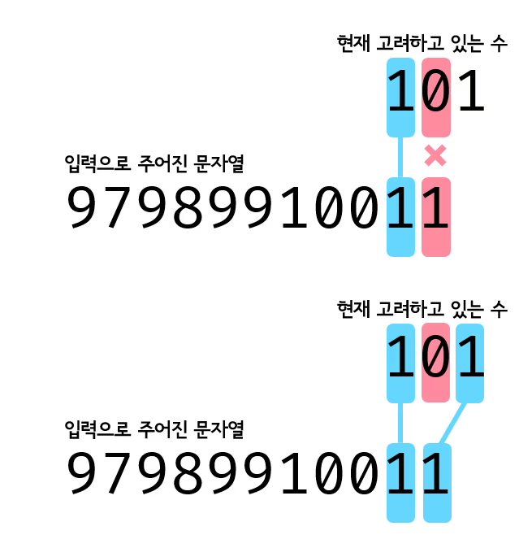

## 접근법

```
input = 234092

num = 0
1이 나와야 하는데 2가 나옴 -> 1보다 큰 수 중에 2를 포함하는 가장 빠른 수 찾기 -> num = 2
3이 나와야 하는데 3이 나옴 -> num = 3
4가 나와야 하는데 4가 나옴 -> num = 4
5가 나와야 하는데 0이 나옴 -> 5보다 큰 수 중에 0을 포함하는 가장 빠른 수 찾기 -> num = 10
11이 나와야 하는데 92(자릿수 맞추기)가 나옴 -> 10보다 큰 수 중에 9를 포함하는 가장 빠른 수 찾기 -> num = 19
20이 나와야 하는데 2가 나옴 -> 19보다 큰 수 중에 2를 포함하는 가장 빠른 수 찾기 -> num = 20
```

```
// 최소 케이스
input = ''
input의 길이가 0일 경우 답은 1
```

## 첫 번째 시도 (오답)

```js
const filePath = process.platform === 'linux' ? '/dev/stdin' : './Javascript/input.txt';
const input = require('fs').readFileSync(filePath).toString().trim();

let num = 0;
for (let i = 0; i < input.length; i) {
    const numString = (num + 1).toString();
    const numLen = numString.length;
    const targetNumString = input.slice(i, i + numLen);
    if (numString === targetNumString) {
        num = +targetNumString;
        i += numLen;
    } else {
        i += findNum(numString, targetNumString);
    }
}

console.log(num || 1);

function findNum(numString, target) {
    let i = +numString;
    while (true) {
        for (let j = target.length; j >= 1; j--) {
            const targetStr = target.slice(0, j);
            if (i.toString().includes(targetStr)) {
                num = i;
                return j;
            }
        }
        i++;
    }
}
```

### 반례

```
1,2,3 ... 100,11

answer : 101
wrong answer: 102
```

### 원인

**findNum()**  
`findNum()`함수에서 `targetStr`은 `target`을 `slice()` 로 자른 문자열이 들어간다.

만약 `numString`이 3자리 수라면 `target`의 자릿수는 `findNum()`함수에 인수로 전달되는 `targetNumString`이 `slice`로 `numString`의 길이만큼 잘렸으므로 3자리거나 그보다 작을 것이다.

그렇게 해서 만약 `target`이 `'000'`이라면 `targetStr`은 `'000', '00', '0'` 순으로 바뀌며 `numString`에 `targetStr`이 포함되는지 확인한다.

포함되지 않는다면 `numString`을 1 증가시키고 포함된다면 `num`을 `numString`으로 바꾸고, 그때의 `targetStr`의 길이인 `j`를 리턴하여 그만큼 인덱스를 증가시킨다.

반례처럼 입력이 주어졌을 때 1,2,3,...,99,100까지 확인하고, 101(`numString`)과 11(`target`)을 비교할 때 둘째 자리의 0이 빠지면 11과 일치하므로 101은 11을 포함하기 때문에 답은 101이 되어야 하지만 내가 작성한 코드에서는 연속된 숫자의 포함 여부만 확인이 가능하다.

따라서 101(`numString`)과 11(`target`)을 비교할 때 `'11'`은 `'101'`에 포함되어 있지 않기 때문에 `targetString = '1'`이 되고 `'1'`은 `101`과 포함되기 때문에 한 자리만 일치한 걸로 판별된다. 따라서 `'102'`라는 오답이 나온다.



## 두 번째 시도 (오답)

```js
const filePath = process.platform === 'linux' ? '/dev/stdin' : './Javascript/input.txt';
const input = require('fs').readFileSync(filePath).toString().trim();

let num = 0;
for (let i = 0; i < input.length; i) {
    const numString = (num + 1).toString();
    const numLen = numString.length;
    const inputNumString = input.slice(i, i + numLen);
    if (numString === inputNumString) {
        num = +inputNumString;
        i += numLen;
    } else {
        i += findNum(numString, inputNumString);
    }
}

console.log(num || 1);

function findNum(numString, target) {
    let count = 0;
    let n = +numString;
    let flag = false;
    while (!flag) {
        numString = n.toString();
        // numString의 길이는 항상 target보다 크거나 같음
        for (let i = 0; i < target.length; i++) {
            for (let j = 0; j < numString.length; j++) {
                if (target[i] === numString[j]) {
                    count++; // 포함된 숫자 개수 카운트
                    numString = numString.slice(j + 1);
                    flag = true;
                    num = n;
                    break;
                }
            }
            if (!flag) break;
        }
        n++;
    }

    return count;
}
```

### 반례

찾지 못함

### 원인

찾지 못함

### 수정 사항

**findNum()**
`findNum()` 함수를 수정했다. `numString = '101'`, `target = '11'` 이라고 했을 때, `target[0] === numString[0]`이기 때문에 카운트를 1 증가시키고 `numString`에서 `numString[0]`을 제거한 부분만 남긴다. 그리고 포함된 숫자가 있다는 뜻에서 `flag`를 `true`로 변경해주고 `break` 하여 `target`의 다음 문자가 `numString`에 포함되는 지 확인한다.

결론적으로 `count = 2`가 되고 `findNum()`함수는 종료되어 2를 반환한다.

따라서 첫 번째 시도때 틀렸던 반례는 통과할 수 있으나 여전히 오답이라고 나와서 머리를 더 굴려보다가 안되겠다 싶어서 다른 블로그를 참고했다.

## 정답 코드

```js
const filePath = process.platform === 'linux' ? '/dev/stdin' : './Javascript/input.txt';
const input = require('fs').readFileSync(filePath).toString().trim();

let cur = 0; // 1~N까지 증가하는 역할
let idx = 0;
while (idx < input.length) {
    cur++;
    const curStr = cur.toString();
    for (let i = 0; i < curStr.length; i++) {
        if (curStr[i] === input[idx]) idx++;
    }
}

console.log(cur);
```
